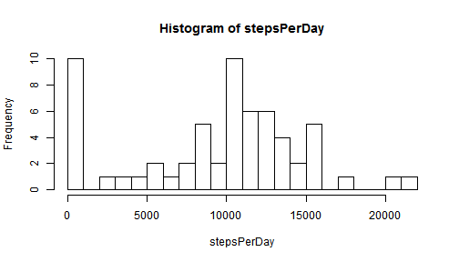
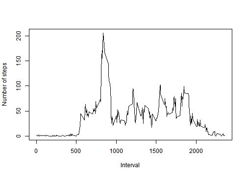
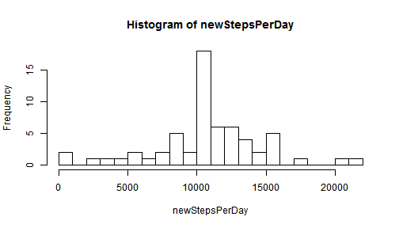
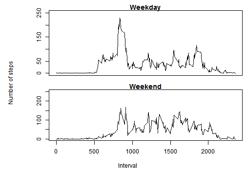

## Loading and preprocessing the data

```r
dataFile <- paste0(getwd(),"/activity.csv")
data <- read.table(dataFile,header=TRUE,sep=",",stringsAsFactors=FALSE)
dataTable <- matrix(data$steps,nrow=288,ncol=61)
```
## What is mean total number of steps taken per day?
Calculate the total number of steps taken per day:

```r
stepsPerDay <- apply(dataTable,2,FUN=sum,na.rm=TRUE)
```
Histogram of the total number of steps taken per day:

```r
hist(stepsPerDay,20)
```

 

Mean steps per day:

```r
mean(stepsPerDay)
```

```
## [1] 9354.23
```
Median steps per day:

```r
median(stepsPerDay)
```

```
## [1] 10395
```
## What is the average daily activity pattern?
Plot a time series of the average daily activity pattern:

```r
stepsVsTime <- apply(dataTable,1,FUN=mean,na.rm=TRUE)
plot(data$interval[1:288],stepsVsTime,type="l",xlab="Interval",ylab="Number of steps")
```

 

Find the 5-minute interval that contains the maximum number of steps:

```r
data$interval[which.max(stepsVsTime)]
```

```
## [1] 835
```

## Imputing missing values
Print the number of rows with missing values:

```r
sum(!complete.cases(data))
```

```
## [1] 2304
```

Replace all NAs by the average of that interval for all days:

```r
newSteps <- data$steps
repStepsVsTime <- rep(stepsVsTime,61)
newSteps[is.na(data$steps)] <- repStepsVsTime[is.na(data$steps)]
newData <- transform(data,steps=newSteps)
newDataTable <- matrix(newData$steps,nrow=288,ncol=61)
```

Calculate the total number of steps taken per day (without NAs):

```r
newStepsPerDay <- apply(newDataTable,2,FUN=sum,na.rm=TRUE)
```

Histogram of the total number of steps taken per day (without NAs):

```r
hist(newStepsPerDay,20)
```

 

Mean steps per day (without NAs):

```r
mean(newStepsPerDay)
```

```
## [1] 10766.19
```

Median steps per day (without NAs):

```r
median(newStepsPerDay)
```

```
## [1] 10766.19
```

Conclusion:
Imputing missing data leads to larger estimates in the statistics of the number of steps per day

## Are there differences in activity patterns between weekdays and weekends?
Create a new dataset with a weekday/weekend factor variable, then split it:

```r
dates <- strptime(data$date,"%Y-%m-%d")
newData <- transform(newData, weekend=as.factor(dates$wday %in% c(0, 6)))
attr(newData$weekend,"levels")<-c("weekday","weekend")
splitData <- split(newData$steps,newData$weekend)
d1 <- matrix(unlist(splitData[1]),nrow=288,ncol=length(unlist(splitData[1]))/288)
d2 <- matrix(unlist(splitData[2]),nrow=288,ncol=length(unlist(splitData[2]))/288)
```

Plot a time series of the average daily activity pattern, separately for weekends and weekdays:

```r
sT1 <- apply(d1,1,FUN=mean,na.rm=TRUE)
sT2 <- apply(d2,1,FUN=mean,na.rm=TRUE)
par(mfrow=c(2,1))
par(mar=c(1,5,1,0),oma=c(2, 2, 0.5, 0.5))
plot(data$interval[1:288],sT1,type="l",xlab="",ylab="",xaxt="n",main="Weekday",ylim=c(0,250))
par(mar=c(3,5,1,0))
plot(data$interval[1:288],sT2,type="l",xlab="",ylab="",main="Weekend",ylim=c(0,250))
mtext("Number of steps", side = 2, outer = TRUE)
mtext("Interval", side = 1, outer = TRUE)
```

 

Conclusions:
* This person seems to sleep at a later time on the weekends
* This person is active almost all day on the weekends but mostly active on weekday mornings
